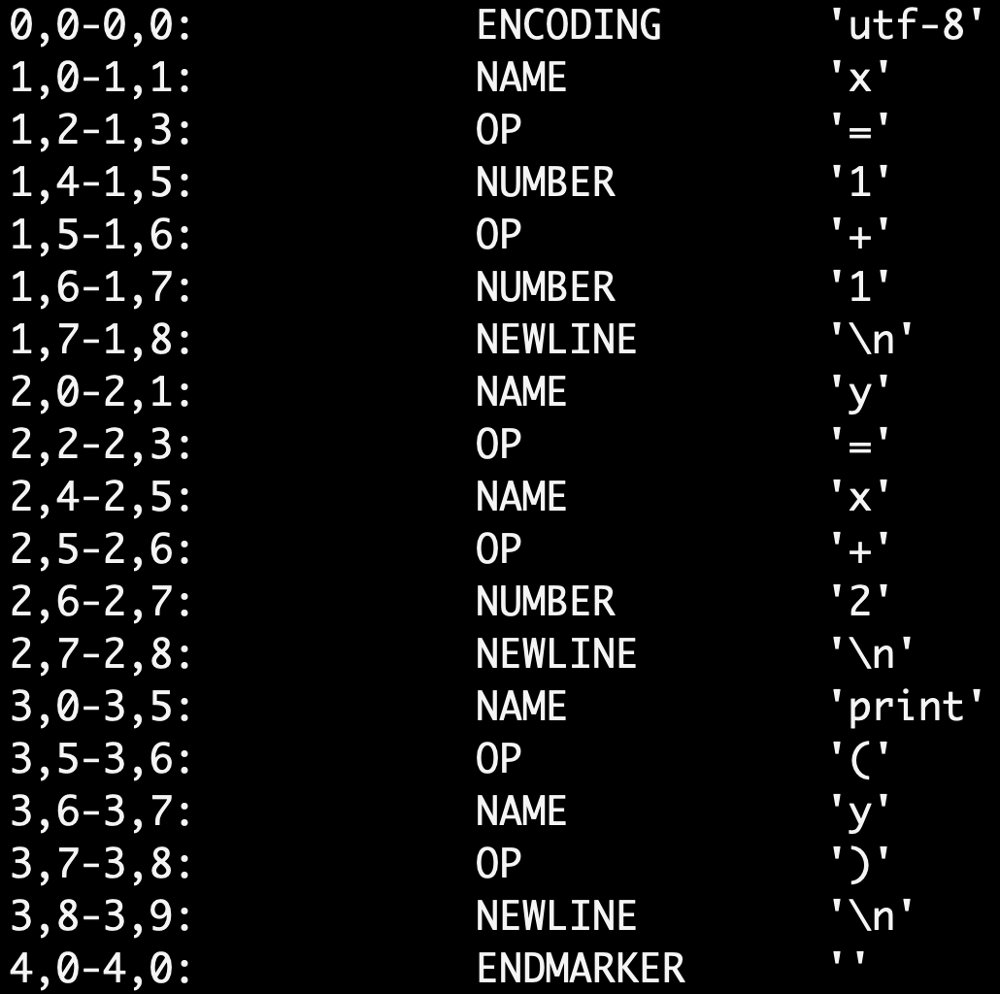
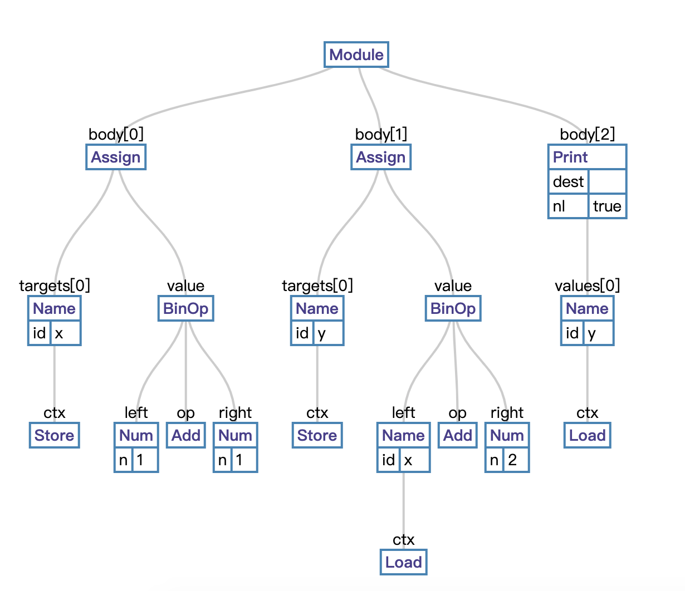

=========
Compiling
=========

1. Python code -> Parse tree
2. Parse tree -> AST
3. Symbol table
4. Code object
5. Flow control graph
6. Code obejct optimization (`Peephole optimization <https://en.wikipedia.org/wiki/Peephole_optimization>`_)
7. Result

*******************
1. Decoding & Lexer
*******************

byte to text

* Parser/tokenizer.c -> PyTokenizer_FromString
* Parser/parsetok.c -> parsetok
* Lib/tokenize.py

*************
2. Tokenizing
*************
text to word

* `tokenize.py <https://github.com/python/cpython/blob/8f59ee01be3d83d5513a9a3f654a237d77d80d9a/Lib/tokenize.py>`_
* `token.py <https://github.com/python/cpython/blob/8f59ee01be3d83d5513a9a3f654a237d77d80d9a/Lib/token.py>`_

``python3 -m tokenize test.py``

**********
3. Parsing
**********

word to sentence structure

* Python/pythonrun.c -> PyParser_ASTFromStringObject

.. code-block:: python

    import parser
    code = "x = 2 + 2"
    st = parser.suite(code)
>>> print(parser.st2list(st))
[257, [269, [270, [271, [272, [274, [305, [309, [310, [311, [312, [315, [316, [317, [318, [319, [320, [321, [322, [323, [324, [1, 'x']]]]]]]]]]]]]]]]], [22, '='], [274, [305, [309, [310, [311, [312, [315, [316, [317, [318, [319, [320, [321, [322, [323, [324, [2, '2']]]]]], [14, '+'], [320, [321, [322, [323, [324, [2, '2']]]]]]]]]]]]]]]]]]], [4, '']]], [4, ''], [0, '']]

`LL_parser <https://en.wikipedia.org/wiki/LL_parser>`_

******
4. AST
******

.. code-block:: python

    import dis
    import ast
    tree = ast.parse("x=2+2")                       
    print(type(ast.dump(tree)))

AST example:

.. code-block:: python

    x= 1 + 1
    y= x + 2
    print(y)

Generated by Python AST Visualizer: https://vpyast.appspot.com/

***********
5. Compiler
***********

`Python/compile.c <https://github.com/python/cpython/blob/master/Python/compile.c>`_

.. code-block:: python

    import dis
    import ast
    tree = ast.parse("x=2+2")
    code_obejct = compile(tree,'test.py',mode='exec')
    dis.dis(code_obejct)

.. code-block:: python

    c = compile(open('test.py').read(), 'test.py', 'exec')

.. seealso:: `How CPython's Compiler Works - Brett Cannon <https://www.youtube.com/watch?v=R31NRWgoIWM>`_